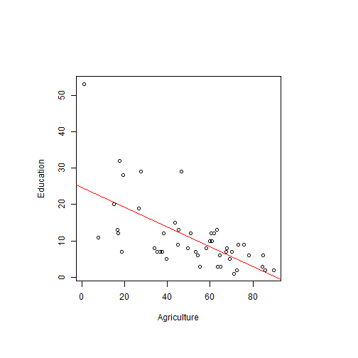

Multivariate regression introduction
=====
transition:rotate
author: Vladimir Jovanovic
font-family: 'Risque'

Introduction
========================================================

The idea for this project is to provide a simple interactive application where a new student can learn some properties of multivariate regression.<br>
The application uses the famous 'swiss' dataset, to predict fertility by using various population factors. The dataset especially good to study variable correlation.

- A user can see how coefficients and p-values change when variables are added/substracted from the linear model
- A user can see that some variables are related

Interactive control
========================================================
- The user can include/exclude variables to be used in regression by checking/unchecking the corresponding checkboxes
- The user selects the variables whose correlation he wants to examine by selecting them from drop-down lists

***


<br>
<br>
<br>


Regression showcase
========================================================
The application will use the variables the user selects to fit a linear model.<br>
If a user checks the checkboxes next to Agriculture, Education and Catholic, the following code will be executed.

```r
lm(Fertility ~ Agriculture + Education + Catholic, swiss)
```

```

Call:
lm(formula = Fertility ~ Agriculture + Education + Catholic, 
    data = swiss)

Coefficients:
(Intercept)  Agriculture    Education     Catholic  
    86.2250      -0.2030      -1.0721       0.1452  
```

Correlation showcase
========================================================
The application will show the correlation between variables selected by user.<br>
If a user selects Agriculture and Education, the following data (and plot) will be displayed:

```
[1] -0.6395225
```

 

